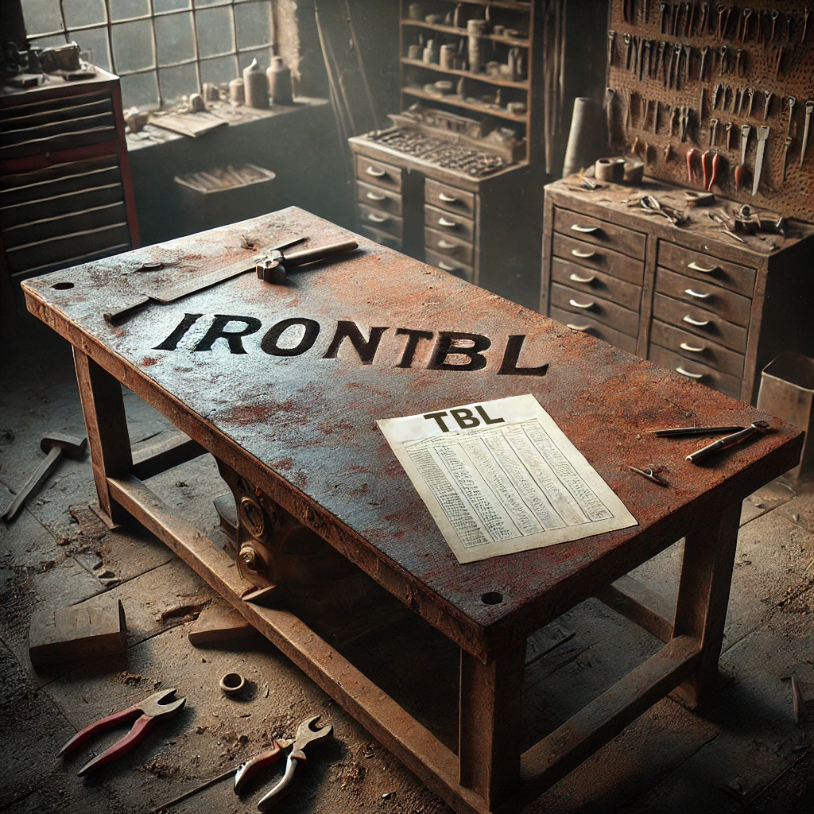

# IronTBL
A tool to convert StarCraft and WarCraft II TBL files to plain text files and back. TBL files are lists of strings, and the games use an index to look up the corresponding string. TBL files contain unit names and stats, dialog and game texts, file paths to resources such as graphics or sounds, etc.

Since the game looks for strings by index, you should avoid inserting or deleting lines, since that would change the indexes.



## Building
```bash
cargo build --release
```

This will create a binary in the `target/release` directory.

### Testing

Run unit and property tests:

```bash
cargo test
```

## Usage
The following arguments can be given:

* `input=<FILE>` - (mandatory) - File to convert from. Either a TBL file or text file, depending on the value given in the `mode` argument.
* `mode=<MODE>` - (mandatory) - Mode of operation. Possible values:
  * `tbl-to-text` - the input file is a TBL file that will be converted to text.
  * `text-to-tbl` - the input file is a text file that will be converted to TBL.
  * `analyse` - perform some analysis of the TBL file given in the input argument.
* `output=<FILE>` - (optional) - File to write to. If this argument is omitted in `tbl-to-text` mode, the file will be written to the terminal (stdout). The argument is mandatory in the `text-to-tbl` mode.
* `control-character-mode=<radix>` - (optional): Determines if control characters should be in `decimal` (default, will be used if argument is omitted), or `hexadecimal`.
* `line-number=<NUMBER>` - (optional): Will only print the given line number rather than the whole file. The first line starts at 0.

## Control characters

By inserting control characters, the formatting and colour of the strings can be controlled. Control characters are numbers inside angle brackets.

Any number between 0 and 255 (decimal), or 00 and FF (hexadecimal) is valid, but the main ones of interest for colour and formatting are 0 to 31 (decimal), or 00 to 1F (hexadecimal). The numbers above 32 (decimal) / 20 (hexadecimal) correspond to the [ASCII table](https://en.wikipedia.org/wiki/ASCII), so putting e.g. `<71>` would be the same as simply typing `G`.


### Button tooltips

The control characters determine what information the game displays for buttons. To display correct resource costs and supply costs, the correct control characters must be used.

#### Other

`<0>` is usually used on hotkeys that aren't any of the others below. Example:

    a<0><3>A<1>ttack<0>
    h<0><4>H<1>AUL OIL<0>

#### Units

`<1>` is used for units or buildings. Example:

    m<1>Train <3>M<1>arine<0>
    g<1>TRAIN <4>G<1>RUNT<0>

#### Upgrades

`<2>` is used for upgrades. Example:

    a<2>Upgrade Infantry <3>A<1>rmor<0>
    w<2>UPGRADE S<4>W<1>ORDS (Damage +2)<0>

#### Spell Casting

`<3>` is used for spell casting. Example:

    t<3>Psionic S<3>t<1>orm<0>
    c<3>DEATH <4>C<1>OIL<0>

#### Technology

`<4>` is used for technology upgrades in StarCraft but not in WarCraft II. Example:

    p<4>Develop <3>P<1>sionic Storm (Templar ability)<0>

#### Morphing

`<5>` is used in StarCraft but not WarCraft II. It is primarily used on the Guardian and Devourer Aspect on the Mutalisk. It shows the correct mineral and gas cost, but it does not show supply. Example:

    d<5><3>D<1>evourer Aspect<0>

### WarCraft II in-game formatting
| Dec |  Hex | Description                                      |
|----:|-----:|:-------------------------------------------------|
|   0 | 0x00 | End of String                                    |
|   1 | 0x01 | Use Default (White)                              |
|   4 | 0x04 | Yellow                                           |
|   9 | 0x09 | Tab                                              |
|  10 | 0x0A | Newline                                          |
|  60 | 0x3C | The '<' character                                |
|  62 | 0x3E | The '>' character                                |


### StarCraft in-game formatting

The following is for control characters in-game. They affect all in-game text, including Mission Objectives. Notably, the "Grey" and "Invisible" characters will override all subsequent control characters until their effects are stopped by a line break.

Line breaks do not stop control characters in Mission Objectives. Among other things, this means that invisible and grey control characters in Mission Objectives will affect all text that comes after them, up to the end of the string.


| Dec |  Hex | Description                                      |
|----:|-----:|:-------------------------------------------------|
|   0 | 0x00 | End of String                                    |
|   1 | 0x01 | Use Default (Cyan)                               |
|   2 | 0x02 | Cyan                                             |
|   3 | 0x03 | Yellow                                           |
|   4 | 0x04 | White                                            |
|   5 | 0x05 | Grey                                             |
|   6 | 0x06 | Red                                              |
|   7 | 0x07 | Green                                            |
|   8 | 0x08 | Red (Player 1)                                   |
|   9 | 0x09 | Tab                                              |
|  10 | 0x0A | Newline                                          |
|  11 | 0x0B | Invisible                                        |
|  12 | 0x0C | Remove beyond (large font), newline (small font) |
|  13 | 0x0D | Light blue                                       |
|  14 | 0x0E | Blue (Player 2)                                  |
|  15 | 0x0F | Teal (Player 3)                                  |
|  16 | 0x10 | Purple (Player 4)                                |
|  17 | 0x11 | Orange (Player 5)                                |
|  18 | 0x12 | Right Align                                      |
|  19 | 0x13 | Center Align                                     |
|  20 | 0x14 | Invisible                                        |
|  21 | 0x15 | Brown (Player 6)                                 |
|  22 | 0x16 | White (Player 7)                                 |
|  23 | 0x17 | Yellow (Player 8)                                |
|  24 | 0x18 | Green (Player 9)                                 |
|  25 | 0x19 | Brighter Yellow (Player 10)                      |
|  26 | 0x1A | Cyan                                             |
|  27 | 0x1B | Pinkish (Player 11)                              |
|  28 | 0x1C | Dark Cyan (Player 12)                            |
|  29 | 0x1D | Greygreen                                        |
|  30 | 0x1E | Bluegrey                                         |
|  31 | 0x1F | Turquoise                                        |
|  60 | 0x3C | The '<' character                                |
|  62 | 0x3E | The '>' character                                |

### StarCraft menu formatting

These control characters are for the pregame lobby.

| Dec |  Hex | Description            |
|----:|-----:|:-----------------------|
|   1 | 0x01 | Mimick (Default: Cyan) |
|   2 | 0x02 | Cyan                   |
|   3 | 0x03 | Green                  |
|   4 | 0x04 | Light Green            |
|   5 | 0x05 | Grey                   |
|   6 | 0x06 | White                  |
|   7 | 0x07 | Red                    |
|   8 | 0x08 | Black                  |
|   9 | 0x09 | Tab                    |
|  10 | 0x0A | Newline                |
|  11 | 0x0B | Invisible              |
|  12 | 0x0C | Remove beyond          |
|  13 | 0x0D | Light blue             |
|  14 | 0x0E | Black                  |
|  15 | 0x0F | Black                  |
|  16 | 0x10 | Black                  |
|  17 | 0x11 | Black                  |
|  18 | 0x12 | Right Align            |
|  19 | 0x13 | Center Align           |
|  20 | 0x14 | Invisible              |
|  21 | 0x15 | Black                  |
|  22 | 0x16 | Black                  |
|  23 | 0x17 | Black                  |
|  24 | 0x18 | Black                  |
|  25 | 0x19 | Black                  |
|  26 | 0x1A | Black/Cyan?            |
|  27 | 0x1B | Black                  |
|  28 | 0x1C | Black                  |
|  29 | 0x1D |                        |
|  30 | 0x1E |                        |
|  31 | 0x1F |                        |
|  60 | 0x3C | The '<' character      |
|  62 | 0x3E | The '>' character      |


## Integrations

Some integrations between IronTBL and other software are in the `integrations` directory, see [here](integrations/README.md).
